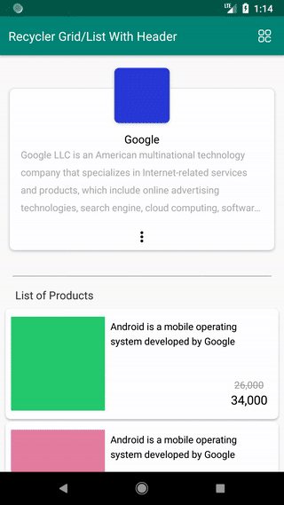

# Recycler View Grid/List With Header & Onloadmore

Recycler View items show in two state
- list
- Grid

Both states are with header! 

In the Recycler View adapter you can add an item as header.

Also, the adapter of Recycler View implemented load more items, when arrived at the end of Recycler View list, start loading items..

